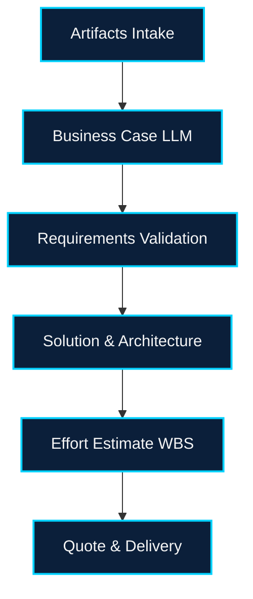

# EPIC-001 — Estimates Workflow Backbone

## Overview
- Build the six-stage estimates workflow defined in `PRD.md`, leveraging the existing CopilotKit + LangGraph Next.js app in `fs-agent`.
- Convert the inherited AGUI project into the Shared State pattern so that stage data, approvals, and Copilot actions remain synchronized across clients.
- Provide demo-ready data seeds and validations so the entire workflow can be completed end-to-end within 10 minutes of setup.

## Problem Statement
Product leadership needs a repeatable, auditable estimation pipeline that captures context, generates LLM-assisted artifacts, and enforces approvals before pricing is shared. Today, the repo lacks Supabase-backed multi-stage persistence, UI scaffolding, and Copilot hooks tailored to estimates.

## Goals & Non-Goals
- **Goals**: Stage-specific UI/UX, storage, approvals, timeline history, Copilot actions for hours adjustments and totals, CSV export, and demo data.
- **Non-Goals**: Detailed rate-card admin UI (seed via config), enterprise auth, or production-grade file storage.

## Scope
1. Projects list with filters, stage pills, owner + timestamps.
2. Project detail page with stepper, validation banners, artifact uploads (≥2 enforced), timeline of transitions, approval gating for each stage.
3. LLM + agent integrations for Business Case, Requirements, WBS, and Quote adjustments using Copilot actions.
4. CSV export and copy-to-clipboard for quotes plus "mark delivered" state.

## Dependencies
- STORY-001 Shared State Bootstrap must complete so all estimates views run on the CopilotKit Shared State baseline described in the [CopilotKit LangGraph Shared State docs](https://docs.copilotkit.ai/langgraph/shared-state).
- `fs-agent` Next.js runtime, LangGraph agent services, and CopilotKit shared state libraries noted in `features/estimates_workflow/requirements.md`.
- Supabase (PostgreSQL + storage) schema for projects, artifacts, approvals, and transitions plus seeded RAW_TEXT artifacts.
- Contract validation hooks (EPIC-002) for cross-linking.

## Success Metrics
- Every stage can be advanced only when entry criteria met (artifacts ≥2, approvals logged, validations recorded).
- Copilot supports at least the three required actions (adjust hours, add line item, get totals) and updates UI via shared state stream.
- CSV export generates quote snapshot; demo script completes all stages in <10 minutes.

## High-Level Plan

## Risks & Mitigations
- **LLM latency**: Cache intermediate outputs and show optimistic placeholders.
- **File handling**: Start with local storage abstraction compatible with S3 to ease future swap.
- **Approval workflow complexity**: Centralize validation logic in shared server utility to reuse across stages.

## Exit Criteria
- Seeded project can progress from Artifacts through Quote with timeline + approvals captured in Supabase (Postgres tables + storage buckets).
- Copilot commands mutate WBS/Quote data and results stream into UI without refresh.
- Documentation in `APPROACH.md` and `TESTING.md` covers at least three backend functions tied to stages.
