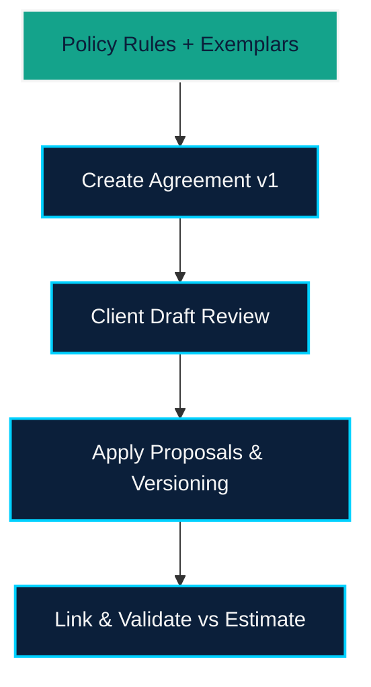

# EPIC-002 — Contracts Workflow & Policy Engine

## Overview
Deliver the policy-aware contracts workspace covering policy CRUD, agreement lifecycle (create, review, version), client draft comparison, and estimate validation as mandated by `PRD.md` and `features/contracts_workflow`. Implementation must piggyback on the `fs-agent` Next.js app and reuse LangGraph agents for policy reasoning and version diffing.

## Problem Statement
Legal + delivery teams need a fast way to draft MSAs/SOWs, review client redlines, and ensure agreements match the approved estimate. Without this workflow, quotes stall and discrepancies slip through, blocking demo credibility.

## Goals
- Policy management dashboard with exemplar ingestion from `RAW_TEXT`.
- Agreement list + detail views exposing version timelines, linked estimate badges, and editable notes.
- Review screen that highlights before/after snippets with accept/reject controls.
- Validation routines comparing linked SOWs to WBS/quote data from EPIC-001.

## Scope Highlights
1. **Policy Setup**: Supabase-backed CRUD APIs/UI, exemplar ingestion helpers, seeding script.
2. **Agreement Creation**: Agent composes v1 based on policy rules + exemplars, stored with metadata.
3. **Review Client Drafts**: Upload/paste path, run policy-based proposals, show rationale, let users apply changes into new version.
4. **Estimate Validation**: Service that fetches WBS + quote, surfaces discrepancies inline.
5. **Notes & Timeline**: UI + persistence for version timeline, reviewer notes, approvals.

## Dependencies
- STORY-001 Shared State Bootstrap (CopilotKit Shared State retrofit) so contract tools inherit the same `GlobalCopilotState` schema described in the [CopilotKit LangGraph Shared State docs](https://docs.copilotkit.ai/langgraph/shared-state).
- Estimate data services from EPIC-001.
- Copilot actions defined in EPIC-003 for summarizing pushbacks, adding notes, applying proposals, and generating agreements from estimates.
- LangGraph tool definitions from `features/contracts_workflow/requirements.md`.
- Supabase schemas for policies, agreements, versions, review proposals, and linked estimates.

## Success Metrics
- At least one seeded MSA + SOW flows through policy import, creation, review, and validation.
- Review proposals show before/after text plus rationale and create new versions when applied.
- Linking a SOW to an estimate surfaces discrepancies covering tasks, roles, hours, payment terms.

## Visualization

## Risks & Mitigations
- **Diff accuracy**: Use `diff` library with sentence granularity and add human-readable context.
- **Policy drift**: Store policy snapshots with each version for audit; refresh agent prompts per request.
- **Estimate linkage**: Define shared contract-to-estimate schema early to avoid data mismatches.

## Exit Criteria
- Policy CRUD, agreement CRUD/versioning, review workflow, and estimate validation are all demoable with Supabase as the system of record.
- Copilot actions for agreements operate through shared state and mutate UI instantly.
- Documentation updated to explain policy ingestion and validation steps.
