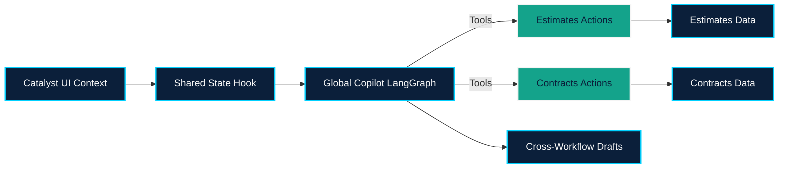

# EPIC-003 — Global Copilot & Shared LangGraph State

## Overview
Implement the right-rail Copilot that orchestrates actions across the Estimates and Contracts workflows using CopilotKit MCP + LangGraph shared state. This epic ensures context awareness (current workflow/entity), ≥6 actionable tools, cross-workflow agreement creation, and streaming UI updates inside the `fs-agent` Next.js shell.

## Problem Statement
Without a unified Copilot, users must manually trigger LLM flows, leading to inconsistent edits and lost auditability. We need a context-aware agent that reads/writes shared state, executes tools, and surfaces remediation hints inline.

## Goals
- Establish `GlobalCopilotState` schema and shared state plumbing using `useCoAgent`.
- Provide the six required tools (3 estimates, 3 contracts) plus the cross-workflow agreement creation helper.
- Deliver cohesive UI (desktop sidebar + mobile sheet) mirroring AGUI Shared State conventions.
- Ensure every Copilot action persists data through Supabase mutations and notifies the relevant React query caches / shared state store.

## Scope
1. **Agent Graph**: LangGraph nodes (start → chat → tool) with workflow-aware system prompt.
2. **Context Sync**: Hooks to update agent state on navigation between `/estimates/*` and `/contracts/*`.
3. **Tool Implementations**: Hours adjustment, line item insertion, totals fetch, summarize pushbacks, add note, apply proposals, create agreements from estimate.
4. **UI Shell**: Sidebar + mobile panel with streaming messages, error callouts, confirmation modals.
5. **Observability**: Debug logging + telemetry hooks for Copilot commands to support demo narratives.

## Dependencies
- Data models/APIs from EPIC-001 and EPIC-002.
- Supabase service client (backend + frontend) configured with RLS/service keys for agent tools.
- CopilotKit MCP runtime (already present) configured for Shared State version (conversion tracked in STORY-001) following the [CopilotKit LangGraph Shared State](https://docs.copilotkit.ai/langgraph/shared-state) design.
- `.env` secrets and LangGraph agent runtime described in `features/copilot_global/requirements.md`.

## Success Metrics
- Copilot executes ≥7 total actions with persisted outcomes and immediate UI updates.
- Cross-workflow command successfully drafts both MSA & SOW from an estimate in <60 seconds.
- Error handling surfaces actionable remediation hints (e.g., missing artifacts, policy mismatch).

## Flow Diagram

## Risks & Mitigations
- **Tool fan-out**: Standardize error contracts so UI can display inline toasts.
- **Shared state drift**: Add versioned schema and guards before merging updates.
- **LLM cost**: Consolidate prompts and reuse context where possible.

## Exit Criteria
- Copilot sidebar operates across all primary pages, actions mutate state, and transcripts logged for `AI_ARTIFACTS.md`.
- Demo scenario uses Copilot to tweak WBS, summarize contract pushbacks, and mint agreements from estimate without manual backend calls.
