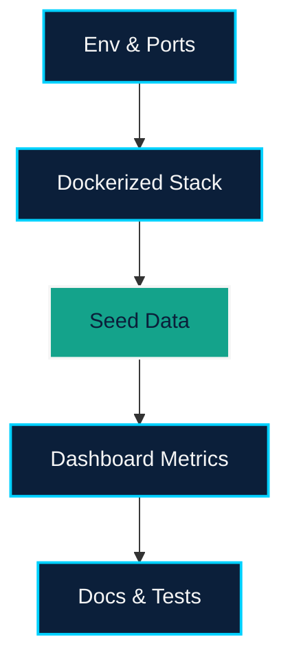

# EPIC-004 — Platform, Dashboard, and Ops Enablement

## Overview
Stand up the shared infrastructure that makes the demoable app possible: environment setup, uv-based virtualenv, Docker packaging, dashboard metrics, seeding, tests, and documentation. This epic ensures `fs-agent` can be run locally (≤10 minutes) without conflicts and exposes the overview dashboard linking both workflows.

## Problem Statement
The current repo lacks consistent setup instructions, dockerization, seeded data, dashboard metrics, and tests required by `PRD.md`. Without these, teammates cannot evaluate EPIC-001–003 outcomes.

-## Goals
- Provide `README.md`, `.env.example`, Dockerfiles/compose, UFW/port guidance, uv virtual environment bootstrapping, and Supabase provisioning notes.
- Deliver dashboard cards showing counts + last-updated timestamps for estimates and contracts.
- Author seeding scripts, test scaffolding (≥3 key server functions), and documentation deliverables (`AI_ARTIFACTS.md`, `APPROACH.md`, `TESTING.md`).

## Scope
1. **Environment & Ops**: uv venv creation, `uv pip` installs, docker-compose orchestrating Next.js + LangGraph backend, Supabase service configuration, confirm no port collisions (documented UFW updates).
2. **Dashboard UI**: `/` route with two cards showing metrics from `/api/dashboard/metrics`, linking into `/estimates` and `/contracts`.
3. **Data Seeds**: Scripts to preload projects, artifacts, policies, exemplars, agreements into Supabase (database + storage buckets).
4. **Testing**: Cover proposal application, Copilot action execution, and estimate generation logic.
5. **Docs & Loom**: Capture AI prompts, approach notes, testing guidance, and record a ≤15 min Loom demo.

## Dependencies
- Metrics endpoints consume data produced in EPIC-001/002.
- Copilot instrumentation from EPIC-003 for testing docs.

## Success Metrics
- Fresh clone can run `uv venv && uv pip sync` (or equivalent) and `docker compose up` to run the stack in ≤10 minutes with Supabase credentials configured.
- Dashboard reflects accurate counts + timestamps sourced from APIs backed by Supabase data.
- Tests documented and runnable via `uv run pytest ...` (or chosen framework) with at least three key server functions covered.

## Visualization

## Risks & Mitigations
- **Port conflicts**: Run `ufw`/Docker port audit and document reserved ports before compose up.
- **Time-to-demo**: Automate seeding via scripts referenced in README.
- **Testing debt**: Wire tests early via LangGraph harness to avoid scramble.

## Exit Criteria
- Ops docs and Docker configs merged; lints/tests run cleanly via uv workflows.
- Dashboard live with navigation to both workflows.
- Required documentation + Loom demo tracked as deliverables.
