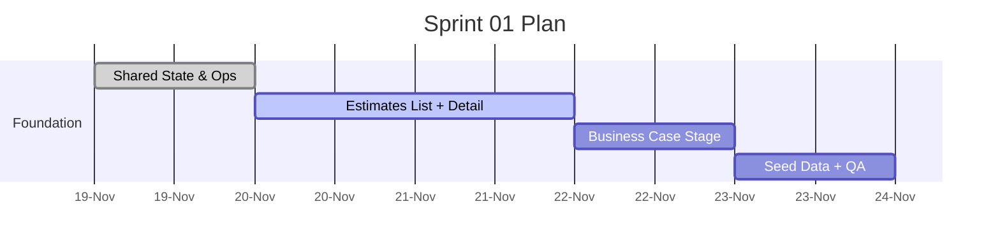

# Sprint 01 — Shared State Foundation & Estimates Core
**Duration**: Week 1 (5 working days)

## Sprint Goal
Upgrade `fs-agent` to the CopilotKit Shared State architecture, establish uv-based tooling + docker baseline, wire Supabase as the persistence layer, and ship the Estimates workflow through the Requirements stage with list/detail UX and seeded data.

## Included Stories
- STORY-001 Shared State Bootstrap & Ops
- STORY-002 Estimates List UI
- STORY-003 Stage Stepper & Timeline
- STORY-004 Business Case Agent Flow

## Backlog Items
1. Convert CopilotKit integration to Shared State (desktop + mobile) per [CopilotKit LangGraph Shared State](https://docs.copilotkit.ai/langgraph/shared-state) and wire LangGraph agent loader.
2. Stand up uv venv, docker compose, Supabase env configuration, and document port/ufw assumptions.
3. Implement `/estimates` list with filters, stage pills, owner + timestamps.
4. Build project detail scaffolding: stepper, validation callouts, timeline logging, artifacts upload gate (≥2 files).
5. Integrate Business Case stage with LLM + approval controls, storing outputs.
6. Seed at least two sample projects with artifacts + partial stage data inside Supabase.

## Definition of Done
- Running `uv run pnpm dev` (or docker equivalent) boots the Next.js UI + agents without manual tweaks.
- Artifacts, Business Case, and Requirements stages are navigable with validation + approvals enforced.
- Copilot shared state ready for future stories (context updates, streaming rendering verified with mock tool).

## Timeline

## Risks & Mitigations
- **Toolchain churn**: lock uv + pnpm versions in docs.
- **Supabase provisioning**: script environment setup and provide fallback SQL for reseeding.
- **File uploads**: provide local adapter and mock S3 interface for parity.
- **LLM prompts**: version prompts in `AI_ARTIFACTS.md` to minimize drift.
