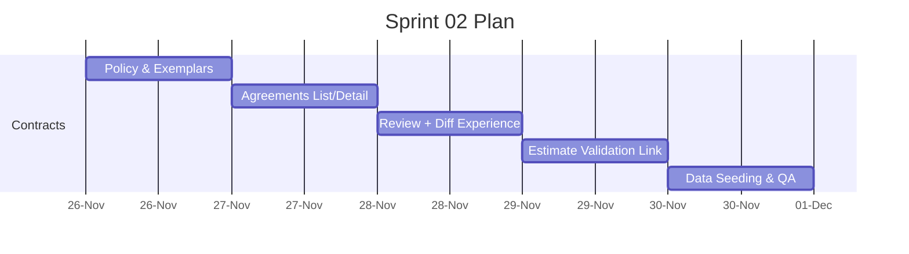

# Sprint 02 — Contracts Workflow & Estimate Linkage
**Duration**: Week 2 (5 working days)

## Sprint Goal
Deliver the Contracts policy manager, agreements workspace, review flow, and linkage to Supabase-backed Estimates data so legal workflows can progress through versioning and validation.

## Included Stories
- STORY-005 Effort Estimate WBS & API hooks (dependency data)
- STORY-006 Quote Export & Delivery flag
- STORY-007 Policy Management UI
- STORY-008 Agreement Review & Diff
- STORY-009 Estimate Validation Linkage

## Backlog Items
1. Finalize WBS + quote APIs that contracts validation will consume (Supabase reads).
2. Build policy CRUD UI + backend hitting `RAW_TEXT` exemplars persisted to Supabase.
3. Create agreements list/detail views with version sidebar and notes.
4. Implement review proposals screen with before/after snippets using `diff` lib.
5. Wire SOW-to-estimate linking plus discrepancy reporting.
6. Extend Supabase seeds to include at least one policy set, exemplar, and agreement timeline.

## Definition of Done
- Users can draft MSA/SOW, import client draft, review proposals, and apply selected changes to create new versions.
- Linked SOW displays comparison report versus WBS + quote data, highlighting issues inline.
- Policy rules editable via UI and consumed by LangGraph agent prompts.

## Timeline

## Risks & Mitigations
- **Diff noise**: segment text by clauses before diffing; offer snippet context.
- **Cross-service latency**: prefetch estimate data when linking via Supabase RPC or views.
- **Supabase limits**: batch writes and enable row-level policies early.
- **Version drift**: store policy snapshot with each applied proposal.
