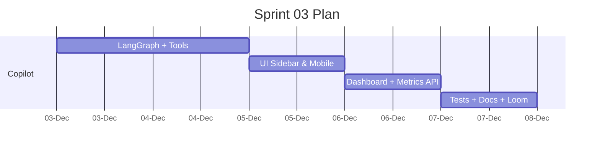

# Sprint 03 — Global Copilot, Dashboard, and Demo Polish
**Duration**: Week 3 (5 working days)

## Sprint Goal
Activate the cross-workflow Copilot with all required tools, finish Supabase-backed dashboard metrics, add automated tests, and finalize docs/demo assets.

## Included Stories
- STORY-010 Global Copilot Shared State Wiring
- STORY-011 Contracts Copilot Actions
- STORY-012 Dashboard Metrics Cards
- (Carryover) Quote export hardening & doc tasks

## Backlog Items
1. Implement LangGraph `global_copilot` graph with system prompt + tool router.
2. Wire UI sidebar + mobile chat, ensuring context sync on navigation.
3. Build all six workflow-specific tools plus cross-workflow agreement generator, ensuring Supabase writes stay consistent.
4. Surface Copilot errors inline with remediation hints.
5. Implement `/api/dashboard/metrics` (Supabase aggregate) and card UI.
6. Add ≥3 backend tests + document instructions, plus record Loom demo.

## Definition of Done
- Copilot executes hours adjustment, line item addition, totals fetch, summarize pushbacks, add note, apply proposals, and create agreements from estimate with Supabase persistence confirmed.
- Dashboard reflects accurate counts + timestamps from live Supabase data.
- Docs (`README`, `APPROACH`, `AI_ARTIFACTS`, `TESTING`) updated with Supabase setup; Loom demo link recorded.

## Timeline

-## Risks & Mitigations
- **Tool failures**: implement retries + structured error payloads.
- **Supabase outages**: enable local emulator fallback for demos.
- **Doc overload**: create template checklists early; update daily.
- **Demo timing**: rehearse workflow and record Loom once features stable.
